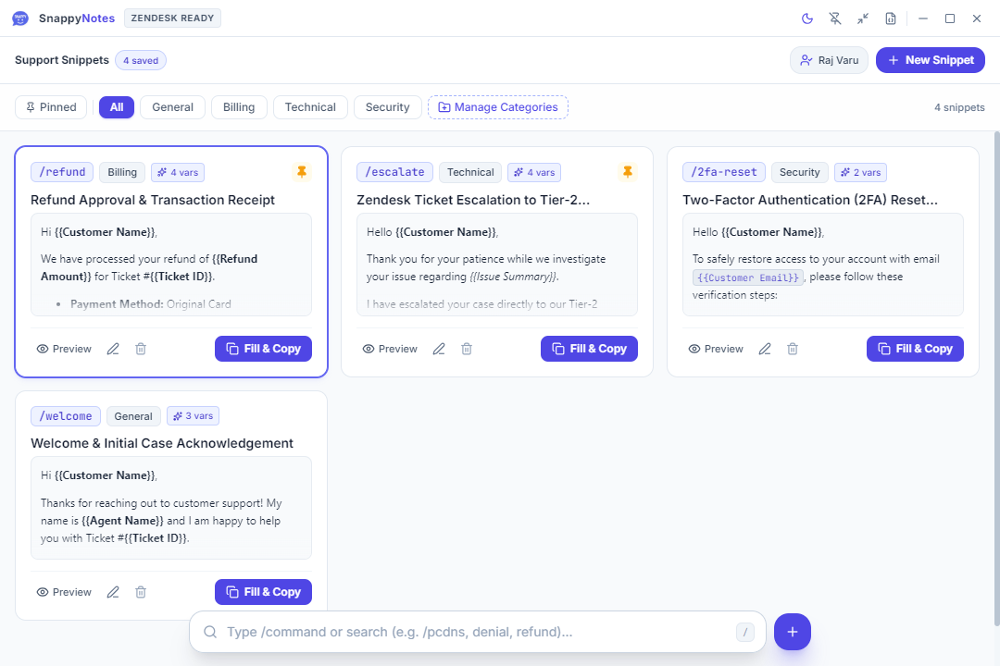
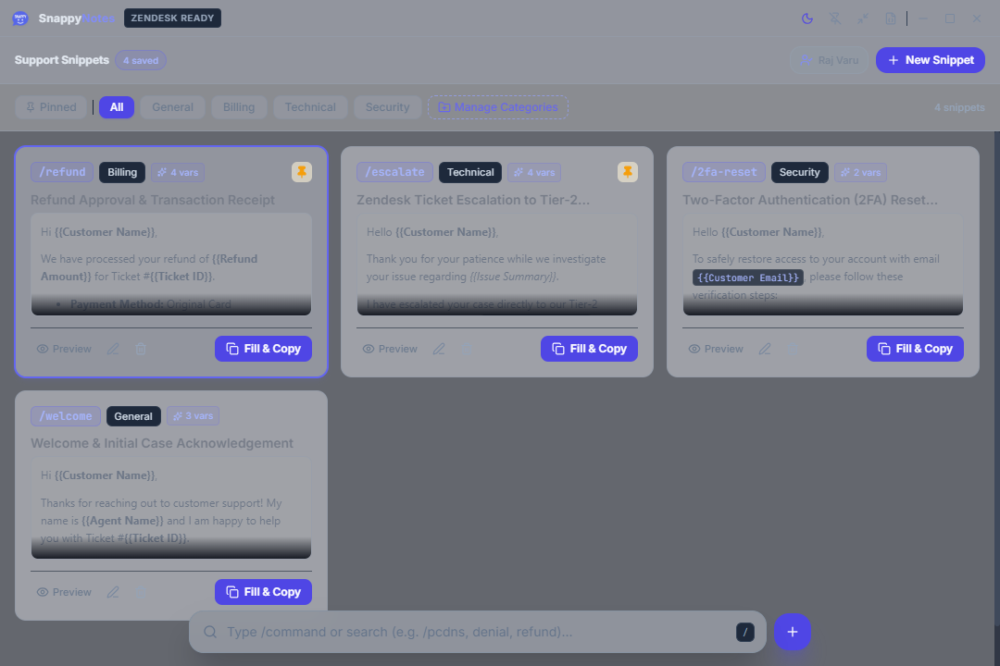
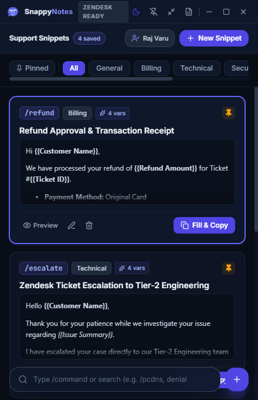

<div align="center">

  

  # SnappyNotes ⚡

  **The ultra-fast, 100% offline snippet & macro companion built for Zendesk and support agents.**

  [](./LICENSE)
  [](https://www.electronjs.org/)
  [](https://react.dev/)
  [](https://vitejs.dev/)
  [](https://tailwindcss.com/)
  [](#-100-offline--data-privacy)

  <p align="center">
    <a href="#-quick-download">Download</a> •
    <a href="#-key-features">Key Features</a> •
    <a href="#-user-guide">User Guide</a> •
    <a href="#-customization--advanced-usage">Customization</a> •
    <a href="#-developer-guide--building">Build from Source</a> •
    <a href="#-author--credits">Author</a>
  </p>

</div>

---

## 📸 Screenshots

| Light Mode Dashboard | Dark Mode Dashboard |
| :---: | :---: |
|  |  |

<div align="center">
  <p><b>Compact Sidebar Mode</b> (Docked beside your browser or Zendesk workspace)</p>
  
</div>

---

## 💡 Why SnappyNotes?

Support agents often juggle dozens of repetitive responses, refund policies, step-by-step guides, and escalation notes throughout their shift. Built-in browser macros or generic clipboard managers often **break formatting**, **strip list styling**, or **store confidential customer data on third-party cloud servers**.

**SnappyNotes** fixes this with:
- **Zendesk-Native HTML Format**: Bullet lists, numbered steps, inline code, bold text, and tables paste cleanly into Zendesk Agent Workspace, Gmail, Outlook, and CRM portals without distorted formatting.
- **Zero Cloud Reliance**: Everything is saved to a local JSON file on your machine. No accounts, no subscriptions, zero network requests, 100% compliant with enterprise privacy policies.
- **Sub-Second Speed**: Instant fuzzy search, slash command shortcuts (`/refund`, `/escalate`), and global hotkeys (`Ctrl + Shift + S`).

---

## ⚡ Key Features

### 📝 1. Zendesk-Compatible Rich Formatting
- Full WYSIWYG editor powered by **TipTap**.
- Automatically generates both rich `text/html` and a clean `text/plain` fallback with unicode bullets (`• `).
- Preserves headers, bold, italics, tables, quote blocks, and nested lists when pasting into Zendesk tickets.

### 🔍 2. Typo-Tolerant Fuzzy Search (Fuse.js)
- Search across titles, body content, slash commands, categories, and tags simultaneously.
- Forgives typos: searching `denil`, `refnd`, or `esclate` will find the right snippet effortlessly.

### 🪄 3. Dynamic Template Variables (`{{Placeholders}}`)
- Define snippets with placeholders such as `{{Customer Name}}`, `{{Ticket ID}}`, `{{Refund Amount}}`, or `{{Agent Name}}`.
- Clicking **Fill & Copy** prompts a quick modal with live preview, letting you fill in variables in seconds.
- Automatically pre-fills your configured **Agent Name**.

### 📌 4. Always-on-Top Floating & Compact Mode
- **Pin Button**: Keep SnappyNotes floating on top of your browser while handling tickets.
- **Compact View**: Shrink into a sleek sidebar layout designed to sit comfortably next to Zendesk.
- **Global Shortcut**: Press <kbd>Ctrl</kbd> + <kbd>Shift</kbd> + <kbd>S</kbd> anytime in Windows to bring SnappyNotes forward instantly.

### 🔒 5. 100% Offline & Data Privacy
- All snippets, custom categories, and agent settings are saved directly to:
  ```text
  %USERPROFILE%\Documents\SnappyNotes\snippets.json
  ```
- Instant Backup Export & Restore tools built into the application.

---

## 🚀 Quick Download

Pre-compiled Windows binaries are located in the `release/` directory:

| Edition | File | Description |
| :--- | :--- | :--- |
| **Standalone Portable** | `release/Portable/SnappyNotes-Portable-1.0.0.exe` | No installation needed. Run directly from anywhere (including USB drives). |
| **Setup Wizard Installer** | `release/Setup/SnappyNotes-Setup-1.0.0.exe` | Windows NSIS installer with Start Menu and Desktop shortcuts. |

---

## 📖 User Guide

### 1. Creating a Snippet
1. Press <kbd>Ctrl</kbd> + <kbd>N</kbd> or click the **"+ New Snippet"** button in the header.
2. Enter a **Title** (e.g., `Refund Approval`).
3. Set an optional **Slash Command** trigger (e.g., `/refund`).
4. Select or create a **Category** (e.g., `Billing`).
5. Add searchable **Tags** (e.g., `refund, stripe, invoice`).
6. Write your response using the rich text toolbar. Use `{{Variable Name}}` anywhere you need dynamic text.
7. Click **"Save Snippet"**.

### 2. Copying & Pasting to Zendesk
- **Instant Copy**: Click the **Copy** icon on any card or select it with arrow keys and press <kbd>Enter</kbd>.
- **Fill Variables & Copy**: If a snippet has `{{Placeholders}}`, clicking Copy opens a prompt to fill values with a live Zendesk preview.
- **Paste**: Press <kbd>Ctrl</kbd> + <kbd>V</kbd> inside your Zendesk ticket or email editor.

### 3. Using Slash Commands & Search
- Press <kbd>/</kbd> or <kbd>Ctrl</kbd> + <kbd>F</kbd> from anywhere in the app to focus search.
- Type `/command` or search keywords to filter instantly.

---

## ⚙️ Customization & Advanced Usage

### Setting Default Agent Name
Click the **Agent Name** pill in the top header or open **Settings** (<kbd>FileJson</kbd> icon in title bar) to set your default agent name. This automatically replaces `{{Agent Name}}` across all macros.

### Managing Categories
Click the **"Manage Categories"** button on the category pill bar to add custom categories (e.g., *Billing*, *Technical Support*, *Security*, *Onboarding*).

### Backup & Direct JSON Editing
- **Export Backup**: Settings > **Export Backup** creates a timestamped JSON file.
- **Import Backup**: Settings > **Import Backup** restores a snippet library.
- **Direct File**: Click **"Open Storage Folder"** in Settings to view and edit `snippets.json` in VS Code or any text editor.

---

## ⌨️ Keyboard Shortcuts

| Shortcut | Description |
| :--- | :--- |
| <kbd>/</kbd> or <kbd>Ctrl</kbd> + <kbd>F</kbd> | Focus search bar |
| <kbd>Ctrl</kbd> + <kbd>Shift</kbd> + <kbd>S</kbd> | Global hotkey to summon SnappyNotes |
| <kbd>Ctrl</kbd> + <kbd>N</kbd> | Create a new snippet |
| <kbd>↑</kbd> / <kbd>↓</kbd> | Navigate snippet cards |
| <kbd>Enter</kbd> | Copy selected snippet to clipboard |
| <kbd>Esc</kbd> | Clear search query or close active modal |

---

## 🛠️ Developer Guide & Building

### Prerequisites
- [Node.js](https://nodejs.org/) (v18.x or v20.x recommended)
- `npm` (bundled with Node.js)
- [Git](https://git-scm.com/)

### 1. Clone & Install Dependencies
```bash
git clone https://github.com/Raj-varu/SnappyNotes.git
cd SnappyNotes
npm install
```

### 2. Run in Development Mode
Starts the Vite dev server and Electron window with live hot module reloading:
```bash
npm run dev
```

### 3. Build & Package Windows Binaries

#### Build Both Portable & Installer:
```bash
npm run package
```
*Outputs will be placed directly in `dist-electron/` and organized into `release/Portable/` and `release/Setup/`.*

#### Build Portable Standalone Only:
```bash
npm run package:portable
```

#### Build Setup Installer Wizard Only:
```bash
npm run package:installer
```

---

## 📁 Repository Structure

```
SnappyNotes/
├── electron/
│   ├── main.js                 # Electron main process (IPC handlers, windows, shortcuts)
│   └── preload.js              # Context-isolated secure preload bridge
├── src/
│   ├── components/             # UI Components (TitleBar, SnippetCard, Editor, Modals)
│   ├── styles/                 # Tailwind CSS styles and themes
│   ├── utils/
│   │   ├── searchEngine.js     # Fuse.js fuzzy search indexing engine
│   │   └── zendeskClipboard.js # Zendesk rich HTML / plain text clipboard encoder
│   ├── App.jsx                 # Main application state & keyboard controller
│   └── main.jsx                # React root mount
├── build/                      # Master application icons (.ico, .png)
├── docs/screenshots/           # App preview screenshots for documentation
├── public/                     # Static assets, web icons, favicons
├── release/                    # Organized prebuilt binaries
│   ├── Portable/               # Standalone .exe
│   └── Setup/                  # Setup Installer .exe
├── scripts/                    # Release organization & screenshot automation
├── package.json
└── vite.config.js
```

---

## 📄 License

This project is licensed under the **MIT License** - see the [LICENSE](./LICENSE) file for details.

---

## 👨‍💻 Author & Credits

Created and maintained with ❤️ by **[Raj Varu](https://github.com/Raj-varu)**.

*Contributions, bug reports, and feature suggestions are always welcome! Feel free to open an issue or pull request.*
